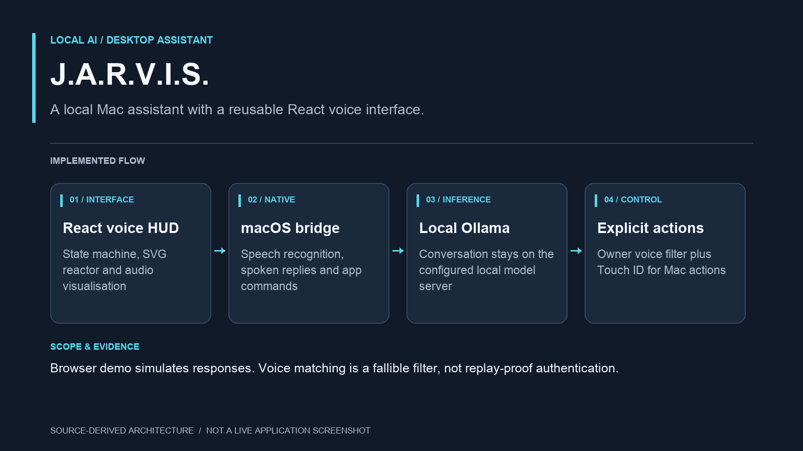

# J.A.R.V.I.S. holographic interface



**Implementation overview:** A local Mac assistant with a reusable React voice interface. [Source map and scope](docs/PORTFOLIO.md).

Browser demo simulates responses. Voice matching is a fallible filter, not replay-proof authentication.

A React + TypeScript animated UI shell with Framer Motion, SVG reactor geometry and canvas audio/particle rendering, plus a native Mac assistant. The Mac app adds private Ollama conversation, on-device speech recognition, spoken replies, and explicit Mac commands. The browser demo remains an independent UI simulation.

## Mac desktop app

Open `~/Applications/JARVIS.app`. The Mac app supports local voice enrollment for Fardeen, Touch ID confirmation for Mac actions, and a metallic robotic voice. Voice matching is a fallible filter; it is not replay-proof authentication. See [Mac setup and controls](docs/macos.md) for enrollment, permissions, supported commands, local AI, and building/installing.

```sh
npm run mac:voice-setup
npm run mac:build
npm run mac:install
```

## Run

```sh
npm install
npm run dev
```

`npm run build` checks TypeScript and creates `dist/`. `npm test` runs the state and audio lifecycle tests.

## Reuse

Public exports live in `src/index.ts`. Copy the `src/components`, `src/hooks`, `src/types.ts`, and `src/state.ts` modules into your React project. Install `framer-motion`, `lucide-react`, `@fontsource/rajdhani`, and `@fontsource/share-tech-mono`. Component styles are imported with the components; fonts are bundled locally.

```tsx
import { JarvisHUD, JarvisOrb, useAudioAnalyser } from './jarvis'
import type { JarvisState } from './jarvis'

// Your assistant owns state and responses.
<JarvisHUD
  state={assistantState}
  analyser={inputOrOutputAnalyser}
  response={assistantResponse}
  onCommand={sendToYourAssistant}
  onListen={connectYourMicrophone}
  onStopListening={disconnectYourMicrophone}
  microphoneActive={microphoneActive}
/>

// Orb alone, with optional normalized amplitude (0–1):
<JarvisOrb state="speaking" amplitude={0.65} />
```

`JarvisState` is `idle | listening | processing | speaking`. An `AnalyserNode` takes precedence over `amplitude`. Without either, the orb uses synthetic activity to preview the selected state. No frame-rate React state updates are used.

The HUD has optional callbacks for state previews, sound preferences, commands, and microphone controls. Actions with no callback are disabled. Pass `activity` to replace sample activity entries; diagnostic values are explicitly simulated. `reducedMotion` can force a still presentation; system reduced-motion preferences always take precedence. The settings panel offers a session-local motion override and telemetry visibility.

### Microphone

```tsx
const mic = useAudioAnalyser()
<JarvisHUD
  state={mic.isActive ? 'listening' : 'idle'}
  analyser={mic.analyser}
  onListen={() => { void mic.start() }}
  onStopListening={mic.stop}
  microphoneActive={mic.isActive}
  microphoneStarting={mic.isStarting}
  audioError={mic.error}
/>
```

Microphone access needs HTTPS or localhost and an explicit user action. Errors are shown in the interface. `stop()` and unmount release tracks and close the audio context, including permission requests that resolve late. Mic input is never connected to speakers.

### Output audio / TTS

Provide an analyser connected to the same audio source your assistant plays. For an audio element containing generated speech, create its source once per element:

```ts
// Create/resume within a user gesture. Reuse these objects for future playback.
const context = new AudioContext()
const source = context.createMediaElementSource(audioElement)
const analyser = context.createAnalyser()
analyser.fftSize = 512
analyser.smoothingTimeConstant = 0.8
source.connect(analyser)
analyser.connect(context.destination)
await context.resume()
await audioElement.play()
// Supply analyser to <JarvisOrb state="speaking" analyser={analyser} />.
// Your integration owns pause, end/error state transitions, disconnection,
// and closing the context on teardown. Cross-origin audio needs CORS permission.
```

The browser's `speechSynthesis` API does not expose a PCM stream or analyser connection; for real TTS amplitude, use an audio element, AudioBufferSourceNode, or MediaStream containing the synthesized speech. Synthetic speaking mode is a visual preview, not measured speech.

### State machine

`jarvisStateReducer(state, { type })` supports the sequence:

```
idle --LISTEN--> listening --PROCESS--> processing --SPEAK--> speaking --COMPLETE--> idle
```

`RESET` returns any state to idle. Invalid transitions are ignored. `App.tsx` is a separate demo controller with sample responses and timed transitions; neither exported visual component implements assistant logic.

## Controls and accessibility

- Four buttons preview visual states without requesting microphone access.
- Start listening connects the mic; Stop listening releases it.
- The text console and sample commands exercise the full visual lifecycle.
- Cmd/Ctrl+K focuses the command field; Escape closes settings.
- Keyboard focus, live response announcements, local bundled fonts, responsive layouts and reduced-motion support are included.
- Canvas loops pause in background tabs; device pixel ratio is capped at 2. Static SVG rings animate via transforms. Actual frame rate depends on the device/browser; no universal 60fps claim is made.

Reference APIs: [Motion accessibility](https://motion.dev/docs/react-accessibility), [Web Audio AnalyserNode](https://developer.mozilla.org/en-US/docs/Web/API/AnalyserNode).
